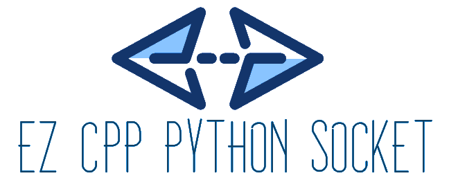
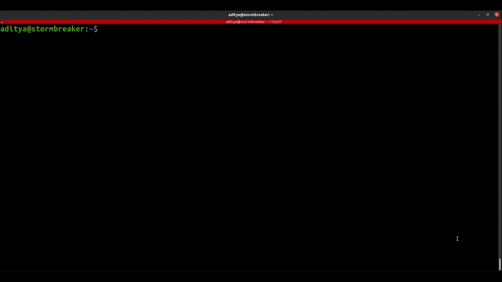

# Ez-Cpp-Python-Socket

<!-- PROJECT LOGO -->
<br />
<p align="center">
  <a href="https://github.com/Aditya-Diva/Ez-Cpp-Python-Socket">
    
  </a>

  <p align="center">
    Cpp Python socket abstraction library that attempts to simplify TCP/IP socket communication.
    <!-- <br />
    <a href="https://github.com/Aditya-Diva/Ez-Cpp-Python-Socket"><strong>Explore the docs »</strong></a>
    <br /> -->
    <br />
    <a href="#about-the-project">View Demo</a>
    ·
    <a href="https://github.com/Aditya-Diva/Ez-Cpp-Python-Socket/issues">Report Bug</a>
    ·
    <a href="https://github.com/Aditya-Diva/Ez-Cpp-Python-Socket/issues">Request Feature</a>
  </p>
</p>


## Table of Contents

* [About the Project](#about-the-project)
  * [Built With](#built-with)
* [Getting Started](#getting-started)
  * [Installation](#installation)
* [Demo](#demo)
  * [Run Examples](#run-examples)
  * [Processed Webcam Stream](#processed-webcam-stream)
  * [Docker](#docker)
  * [Local Installation / VirtualEnv](#local-installation-/-virtualenv)
* [Usage](#usage)
* [Contributing](#contributing)
* [License](#license)
* [Contact](#contact)

## About The Project

> Cpp Python socket abstraction library that attempts to simplify TCP/IP socket communication.


Types of messages that can be sent to and fro are as shown below:

| Type          | Cpp | Python |      Extra Info      |
| :---:         |:---:| :---:  |        :---:         |
| bool          |  Y  |   Y    |                      |
| string        |  Y  |   Y    |                      |
| int           |  Y  |   Y    |                      |
| float         |  Y  |   Y    |                      |
| list<int>     |  Y  |   Y    |vector<int> <-> list  |
| list<float>   |  Y  |   Y    |vector<float> <-> list|
| image         |  Y  |   Y    |     cv::Mat          |

The following configurations are supported:

| Server | Client |
|  :---: | :---:  |
|  Cpp   |  Cpp   |
|  Cpp   |  Py    |  
|  Py    |  Cpp   |  
|  Py    |  Py    |  

Addition Server-Client Configurations include:

* Polling in case address is busy: [Cpp](cpp/examples/1.Polling) [Python](python/examples/1.Polling)
* Start and end tokens for every message passed [Cpp](cpp/examples/2.Tokens) [Python](python/examples/2.Tokens)
* Continuous streaming (with webcam) [Cpp](cpp/examples/3.Webcam) [Python](python/examples/3.Webcam)

### Built With

* Python
* Cpp
* Docker
* OpenCV

## Getting Started

Preferably use dockers or virtual environments.
For a quickstart demo, do not follow local installation steps.

### Installation

1. Clone the repo
    ```sh
    git clone https://github.com/Aditya-Diva/Ez-Cpp-Python-Socket.git
    ```
2. Enter the directory of the repo

3. Follow launch specific instruction
    * Linux Local Installation
        ``` sh
        ./install_dep.sh # Install all python dependencies
        ```
        C++ Dependencies : Install [OpenCV](https://github.com/opencv/opencv)

    * Docker (Linux)
        ``` sh
        ./build_docker.sh # Build docker image in demo or dev mode
        ```

## Demo
### Run Examples


### Processed Webcam Stream


### Docker

```sh
./run_docker.sh # runs demo directly if demo mode was selected while building

# If in dev mode, after launching docker with previous command
./run_examples.sh # run demo
./tests/test_<name_of_test>.sh # to test library configurations as a demo

# Finally to remove the docker image after playing around
./remove_docker.sh # removes docker image from system
```

### Local Installation / VirtualEnv

Assuming that OpenCV has already been installed and accessible by C++.
Run shell script to download python dependencies and run demo.
To run demo of server and client together, 
``` sh
./run_examples.sh
```
To test out demo of example configurations

``` sh
./tests/test_<name_of_test>.sh
```

## Usage

To inspect usage of commands, \
Refer to run_server and run_client scripts in [python](python) & [cpp](cpp) folders.\
For additional examples check out the examples folders in each folder.

## Contributing

Any contributions made are greatly appreciated.

1. Fork the Project
2. Create your Feature Branch (`git checkout -b feature/AmazingFeature`)
3. Commit your Changes (`git commit -m 'Add some AmazingFeature'`)
4. Push to the Branch (`git push origin feature/AmazingFeature`)
5. Open a Pull Request

## License

Distributed under the MIT License. See [`LICENSE`](LICENSE) for more information.

## Contact

Aditya Divakaran - [@LinkedIn](https://www.linkedin.com/in/aditya-divakaran/) - [@Github](https://github.com/Aditya-Diva) - [@GMail](adi.develops@gmail.com)

Note:

* This was tested on Ubuntu 20.04 in a virtual environment and on Docker. 
* Image used in repo is from [Pixabay](https://pixabay.com/photos/bulb-idea-fire-flame-neon-5665770/).
* This is a fun project that was picked up while understanding socket communication for other projects that I'm tinkering with.
