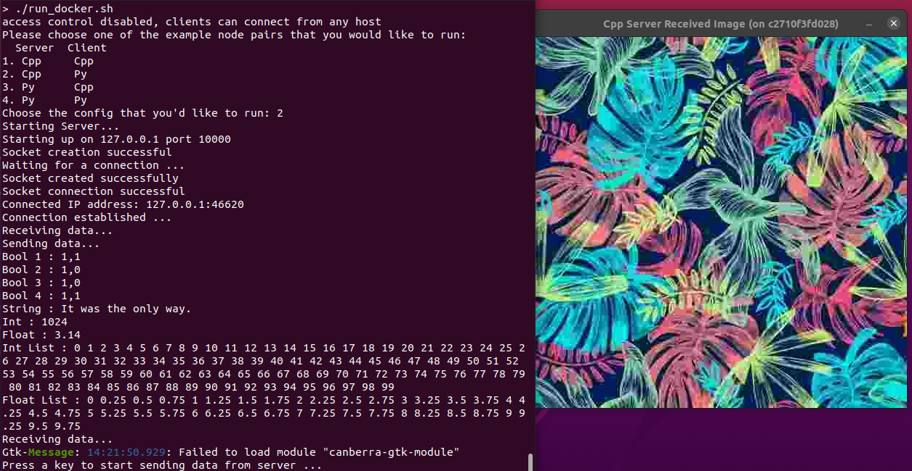
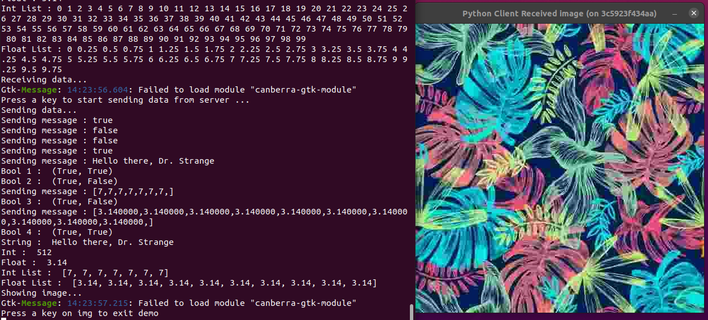

# Ez-Cpp-Python-Socket

> Cpp Python socket abstraction library that attempts to simplify TCP/IP socket communication.

Types of messages that can be sent to and fro are as shown below:

| Type          | Cpp | Python |      Extra Info      |
| :---:         |:---:| :---:  |        :---:         |
| bool          |  Y  |   Y    |                      |
| string        |  Y  |   Y    |                      |
| int           |  Y  |   Y    |                      |
| float         |  Y  |   Y    |                      |
| list<int>     |  Y  |   Y    |vector<int> <-> list  |
| list<float>   |  Y  |   Y    |vector<float> <-> list|
| image         |  Y  |   Y    |     cv::Mat          |

The following configurations are supported:

| Server | Client |
|  :---: | :---:  |
|  Cpp   |  Cpp   |
|  Cpp   |  Py    |  
|  Py    |  Cpp   |  
|  Py    |  Py    |  

Addition Server-Client Configurations include:

* Polling in case address is busy: [Cpp](cpp/examples/1.Polling) [Python](python/examples/1.Polling)
* Start and end tokens for every message passed [Cpp](cpp/examples/2.Tokens) [Python](python/examples/2.Tokens)
* Continuous streaming (with webcam) [Cpp](cpp/examples/3.Webcam) [Python](python/examples/3.Webcam)

### Sample Images





## Installation

Preferably use dockers or virtual environments.

### Linux:

Python Dependencies

``` 

./install_dep.sh
```

C++ Dependencies : Install [OpenCV](https://github.com/opencv/opencv)

## Demo

### Docker

``` sh
./build_docker.sh # build docker image in demo or dev mode
./run_docker.sh # runs docker in mode selected

# To remove the docker image after playing around
./remove_docker.sh # removes docker image from system
```

### Local Installation / VirtualEnv

Assuming that OpenCV has already been installed and accessible by C++.
Run shell script to download python dependencies and run demo.
To run demo of server and client together, 

``` sh
./run_examples.sh
```

To test out demo of example configurations

``` sh
./tests/test_<name_of_test>.sh
```

## Usage Example

To inspect usage of commands, 
Refer to run_server and run_client scripts in [python](python) & [cpp](cpp) folders. For additional examples check out the examples folders in each folder.

## Meta

Aditya Divakaran - [@LinkedIn](https://www.linkedin.com/in/aditya-divakaran/) - [@Github](https://github.com/Aditya-Diva) - [@GMail](adi.develops@gmail.com)

Note:

* This was tested on Ubuntu 20.04 in a virtual environment and on Docker. 
* Image used in repo is from [Pixabay](https://pixabay.com/photos/bulb-idea-fire-flame-neon-5665770/).
* This is a fun project that was picked up while understanding socket communication for other projects that I'm tinkering with.
